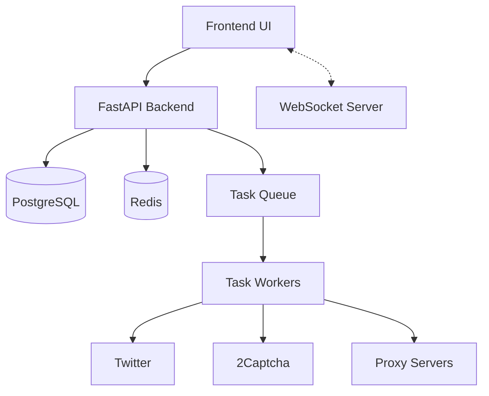

# Xauto System Patterns

## Architecture Overview

### Component Architecture


## Core Components

### 1. Backend API Layer (FastAPI)
- **Pattern**: REST + WebSocket hybrid
- **Key Features**:
  - Async request handling
  - Real-time updates via WebSocket
  - Rate limit enforcement
  - Request validation
  - Error handling

### File Upload Patterns

#### 1. Account Import CSV
```csv
# Required Format
account_no,login,password,email,email_password,auth_token,ct0,proxy_url,proxy_port,proxy_username,proxy_password,user_agent

# Validation Rules
- account_no: Unique identifier (required)
- login: Twitter username (required)
- password: Account password (required)
- email: Recovery email (optional)
- proxy_*: Proxy configuration (all fields required if using proxy)
- user_agent: Custom user agent (optional)

# Example
WACC001,user1,pass123,user1@email.com,emailpass,token123,ct0123,proxy.example.com,8080,proxyuser,proxypass,Mozilla/5.0
```

#### 2. Follow List CSV
```csv
# Internal List Format
username
user1
user2
user3

# External List Format
username
target1
target2
target3

# Validation Rules
- One username per line
- No @ symbol required
- Max 1000 usernames per file
- File size limit: 1MB
```

#### 3. Profile Updates CSV
```csv
# Required Format
account_no,name,description,url,location,profile_image,profile_banner,lang

# Field Requirements
- account_no: Account to update (required)
- name: Display name (max 50 chars)
- description: Bio (max 160 chars)
- url: Website URL
- location: Location string
- profile_image: Direct image URL (jpg/png)
- profile_banner: Direct image URL (jpg/png)
- lang: Language code (e.g., en, es)

# Example
WACC001,John Doe,Bio text here,https://example.com,New York,http://img.url/pic.jpg,http://img.url/banner.jpg,en
```

### 2. Database Layer (PostgreSQL + SQLAlchemy)
- **Pattern**: Repository Pattern
- **Key Models**:
  ```python
  class Account:
      id: PK
      account_no: Unique Internal ID
      act_type: ENUM('Normal', 'Worker')
      login: String
      auth_token, ct0: Session tokens
      proxy_config: Proxy details
      status: Account status
      validation_state: Current state
      
  class Task:
      id: PK
      type: Task type
      status: Current status
      account_id: FK to accounts
      input_params: JSONB
      result: JSONB
      
  class RateLimit:
      id: PK
      account_id: FK
      action_type: String
      window: Time window
      usage: Current usage
      reset_time: Timestamp
  ```

### 3. Task Processing System
- **Pattern**: Producer-Consumer with Priority Queue
- **Task Types**:
  ```python
  VALID_TASK_TYPES = [
      # Tweet interaction tasks
      'like_tweet', 'retweet_tweet', 'reply_tweet', 'quote_tweet', 
      'create_tweet', 'follow_user', 'send_dm',
      # Search and scraping tasks
      'scrape_profile', 'scrape_tweets', 'search_trending', 
      'search_tweets', 'search_users', 'user_profile', 'user_tweets',
      # Profile management tasks
      'update_profile'
  ]
  ```
- **Task Model**:
  ```python
  class Task:
      id: PK
      type: TaskType
      status: Status  # pending, running, completed, failed
      input_params: JSON
      result: JSON
      error: String
      worker_account_id: FK
      priority: Integer
      retry_count: Integer
      execution_time: Float
      worker_account_id: FK to accounts
  ```
- **Task Flow**:
  ```mermaid
  flowchart LR
    API[API] --> Queue[Redis Queue]
    Queue --> Workers[Celery Workers]
    Workers --> Results[Result Store]
    Workers --> WebSocket[WebSocket Updates]
    WebSocket --> UI[Frontend UI]
  ```
- **Task Reassignment**:
  - Prioritize tasks with existing worker assignments
  - Reassign to original worker if available

### 4. Account Management System
- **Pattern**: State Machine with WebSocket Updates
- **Account States**:
  ```mermaid
  stateDiagram-v2
    [*] --> PENDING: Import Account
    PENDING --> VALIDATING: Start Validation
    VALIDATING --> ACTIVE: Validation Success
    VALIDATING --> SUSPENDED: Account Suspended
    VALIDATING --> LOCKED: Account Locked
    SUSPENDED --> RECOVERING: Start Recovery
    LOCKED --> RECOVERING: Start Recovery
    RECOVERING --> ACTIVE: Recovery Success
    RECOVERING --> FAILED: Recovery Failed
  ```

- **WebSocket Updates**:
  ```typescript
  // Status Update Format
  interface StatusUpdate {
    type: 'account_update' | 'task_update' | 'oauth_status';
    account_no: string;
    status: string;
    message: string;
    timestamp: string;
  }

  // Connection States
  type ConnectionState = 
    | 'connecting'    // Initial connection attempt
    | 'connected'     // Successfully connected
    | 'disconnected'  // Lost connection
    | 'reconnecting'  // Attempting to reconnect
    | 'error'         // Connection error
  ```

- **Validation Process**:
  ```python
  # Validation Steps
  1. Check account credentials
  2. Verify proxy connection
  3. Test Twitter authentication
  4. Handle 2FA if needed
  5. Verify account status
  6. Update database state
  7. Broadcast status via WebSocket
  ```
- **Account Model**:
  ```python
  class Account:
      # Core fields
      id: PK
      account_no: String(unique)
      act_type: String  # 'normal' or 'worker'
      login: String
      password: String
      email: String
      
      # Authentication
      auth_token: Text
      ct0: Text
      two_fa: Text
      
      # Proxy Configuration
      proxy_url: String
      proxy_port: String
      proxy_username: String
      proxy_password: String
      
      # Status Fields
      is_active: Boolean
      is_worker: Boolean
      is_suspended: Boolean
      credentials_valid: Boolean
      
      # Rate Limiting
      rate_limit_until: DateTime
      current_15min_requests: Integer
      current_24h_requests: Integer
      last_rate_limit_reset: DateTime
      
      # Validation
      validation_in_progress: ValidationState
      last_validation: Text
      recovery_attempts: Integer
      recovery_status: Text
      
      # Relationships
      tasks: List[Task]
      actions: List[Action]
      rate_limits: List[RateLimit]
  ```

## Design Patterns

### 1. WebSocket Communication Pattern
```typescript
// Frontend WebSocket Service
class WebSocketService {
    private socket: WebSocket;
    private listeners: Map<string, Function[]>;
    private reconnectAttempts: number;
    
    // Connection management
    async connect(): Promise<WebSocket> {
        // Connection logic with retry
    }
    
    // Message handling
    handleMessage(data: any): void {
        // Broadcast to type-specific listeners
        const listeners = this.listeners.get(data.type) || [];
        listeners.forEach(callback => callback(data));
    }
    
    // Subscription management
    subscribe(type: string, callback: Function): void {
        if (!this.listeners.has(type)) {
            this.listeners.set(type, []);
        }
        this.listeners.get(type).push(callback);
    }
    
    // Heartbeat mechanism
    setupHeartbeat(): void {
        setInterval(() => {
            if (this.socket?.readyState === WebSocket.OPEN) {
                this.socket.send(JSON.stringify({ type: 'pong' }));
            }
        }, 15000);
    }
}

// React Context Provider
function WebSocketProvider({ children }) {
    const [isConnected, setIsConnected] = useState(false);
    const [connectionState, setConnectionState] = useState('disconnected');
    
    useEffect(() => {
        // Setup WebSocket connection
        // Handle reconnection
        // Cleanup on unmount
    }, []);
    
    return (
        <WebSocketContext.Provider value={{
            isConnected,
            connectionState,
            sendMessage,
            subscribe,
            unsubscribe
        }}>
            {children}
        </WebSocketContext.Provider>
    );
}
```

### 2. Service Layer Pattern
```python
# Password Management Service
class PasswordManager:
    def __init__(self, account_data: Dict):
        self.account_data = account_data
        self.proxy_config = None
        self.browser = None
        self.new_password = None
        self.old_password = account_data.get('old_password')
        
    async def update_password(self) -> Dict:
        """
        Update account password with security measures.
        
        Password Requirements:
        - Minimum 20 characters
        - Mix of upper/lowercase
        - Numbers and symbols
        - Timestamp suffix
        - No common patterns
        
        Process:
        1. Generate secure password
        2. Update in database
        3. Verify with Twitter
        4. Handle 2FA
        5. Update cookies
        6. Log change securely
        """
        
    async def verify_new_password(self, context) -> bool:
        """
        Verify new password with retry logic.
        
        Retry Strategy:
        - Max 3 attempts
        - Exponential backoff
        - Port rotation on failure
        - Fallback to old password
        """
        
    async def handle_login_attempt(self, page, account) -> bool:
        """
        Handle login attempts with password fallback logic.
        
        Flow:
        1. Try current password
        2. Check if password field remains visible
        3. If visible and old_password exists:
           - Clear password field completely
           - Wait for field to be empty
           - Fill with old_password
           - Submit and verify
        4. Handle result appropriately
        
        Returns:
            bool: True if login successful, False otherwise
        """
        try:
            # Initial login attempt with current password
            await self.submit_password(page, account.password)
            
            # Check for persistent password field
            password_input = await page.wait_for_selector(
                'input[type="password"]',
                timeout=5000
            )
            
            if password_input and account.old_password:
                # Clear field and try old password
                await password_input.fill("")  # Explicit clear
                await asyncio.sleep(2)  # Wait for clear
                await password_input.fill(account.old_password)
                await self.submit_login(page)
                
                # If successful, update account
                if await self.verify_login(page):
                    await self.swap_passwords(account)
                    return True
            
            return False
            
        except PlaywrightTimeoutError:
            # No password field visible - might be successful
            return await self.verify_login(page)
            
        except Exception as e:
            logger.error(f"Login attempt failed: {str(e)}")
            return False
            
    async def swap_passwords(self, account) -> None:
        """
        Update account after successful old password login.
        
        Operations:
        1. Store current as new_password
        2. Set old_password as current
        3. Update database
        4. Log password swap
        """
        temp = account.password
        account.password = account.old_password
        account.old_password = temp
        await self.db.commit()
        logger.info(f"Swapped passwords for account {account.account_no}")
        
    async def test_browser_setup(self) -> bool:
        """
        Test browser configuration.
        
        Checks:
        - Proxy connection
        - JavaScript execution
        - Cookie handling
        - Memory usage
        - Resource cleanup
        """
```

### 2. Repository Pattern with SQLAlchemy
```python
# Account Repository
class AccountRepository:
    def __init__(self, db: AsyncSession):
        self.db = db
    
    async def get_by_account_no(self, account_no: str) -> Account:
        result = await self.db.execute(
            select(Account).where(
                and_(
                    Account.account_no == account_no,
                    Account.deleted_at.is_(None)
                )
            )
        )
        return result.scalar_one_or_none()
    
    async def update_status(
        self, 
        account_no: str, 
        status: str,
        validation_state: ValidationState
    ) -> Account:
        account = await self.get_by_account_no(account_no)
        if account:
            account.status = status
            account.validation_in_progress = validation_state
            account.updated_at = datetime.utcnow()
            await self.db.commit()
        return account
        
    async def get_available_workers(
        self,
        limit: int = 10
    ) -> List[Account]:
        result = await self.db.execute(
            select(Account)
            .where(
                and_(
                    Account.is_worker == True,
                    Account.is_active == True,
                    Account.deleted_at.is_(None),
                    Account.validation_in_progress == ValidationState.COMPLETED
                )
            )
            .limit(limit)
        )
        return result.scalars().all()
```

### 3. Factory Pattern
```python
# Browser/Client factory
class TwitterClientFactory:
    @staticmethod
    async def create_client(account: Account):
        # Create configured client
```

### 4. Strategy Pattern
```python
# Different validation strategies
class ValidationStrategy(ABC):
    @abstractmethod
    async def validate(self, account: Account):
        pass

class NormalAccountValidation(ValidationStrategy):
    async def validate(self, account: Account):
        # Normal account validation

class WorkerAccountValidation(ValidationStrategy):
    async def validate(self, account: Account):
        # Worker account validation
```

## Error Handling Patterns

### 1. Global Exception Handler
```python
@app.exception_handler(Exception)
async def global_exception_handler(request, exc):
    # Log and handle exceptions
```

### 2. Retry Pattern
```python
# Retry with exponential backoff
async def with_retry(func, max_retries=3):
    for attempt in range(max_retries):
        try:
            return await func()
        except Exception as e:
            if attempt == max_retries - 1:
                raise
            await asyncio.sleep(2 ** attempt)
```

## Rate Limiting Pattern

### 1. Token Bucket Algorithm
```python
class RateLimiter:
    def __init__(self, window: int, limit: int):
        self.window = window
        self.limit = limit
        self.tokens = limit
        self.last_update = time.time()

    async def acquire(self):
        # Implement token bucket algorithm
```

## Proxy Management Pattern

### 1. Proxy Rotation
```python
class ProxyManager:
    def __init__(self, proxies: List[Proxy]):
        self.proxies = proxies
        self.current = 0

    def get_next_proxy(self):
        # Rotate proxies
```

## WebSocket Communication Pattern

### 1. Pub/Sub Model
```python
class ConnectionManager:
    def __init__(self):
        self.active_connections = []

    async def broadcast(self, message: dict):
        # Broadcast to all connections
```

## Security Patterns

### 1. Credential Encryption
```python
class CredentialManager:
    def encrypt_credentials(self, credentials: Dict):
        # Encrypt sensitive data
        
    def decrypt_credentials(self, encrypted: bytes):
        # Decrypt sensitive data
```

### 2. Session Management
```python
class SessionManager:
    async def validate_session(self, auth_token: str, ct0: str):
        # Validate Twitter session
```

## Testing Patterns

### 1. Integration Tests
```python
class TestAccountValidation:
    async def test_account_validation():
        # Test validation flow
```

### 2. Unit Tests
```python
class TestPasswordManager:
    async def test_password_update():
        # Test password update
```

## Monitoring Patterns

### 1. Health Checks
```python
@app.get("/health")
async def health_check():
    # Check system components
```

### 2. Metrics Collection
```python
class MetricsCollector:
    async def collect_metrics():
        # Collect system metrics
```

This document outlines the key architectural patterns and design decisions in the Xauto system. It serves as a reference for maintaining consistency in implementation and future development.
